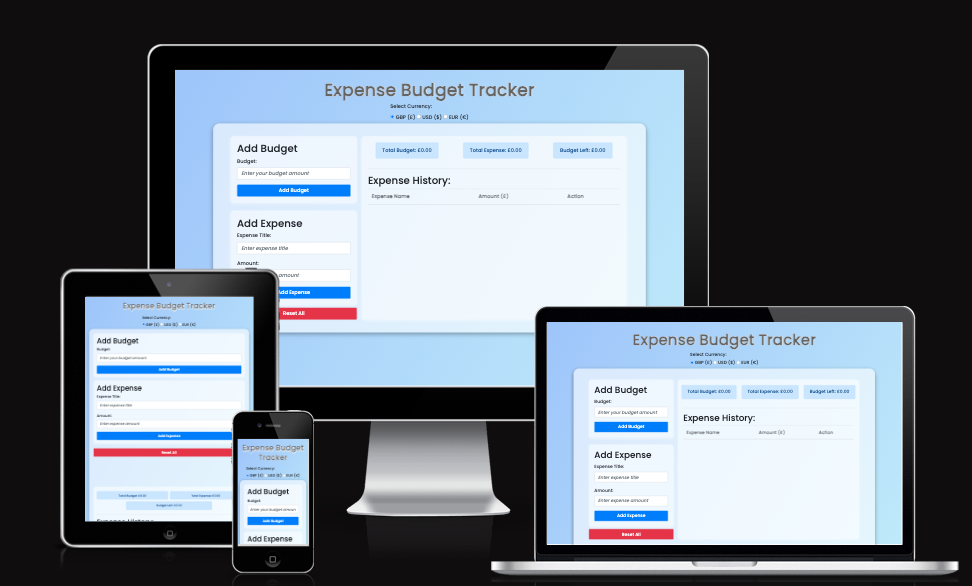
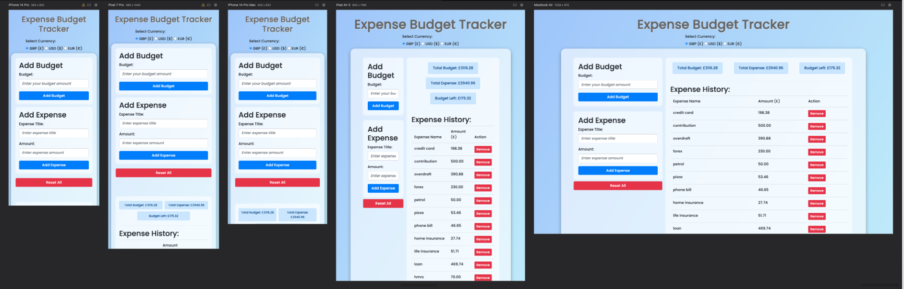
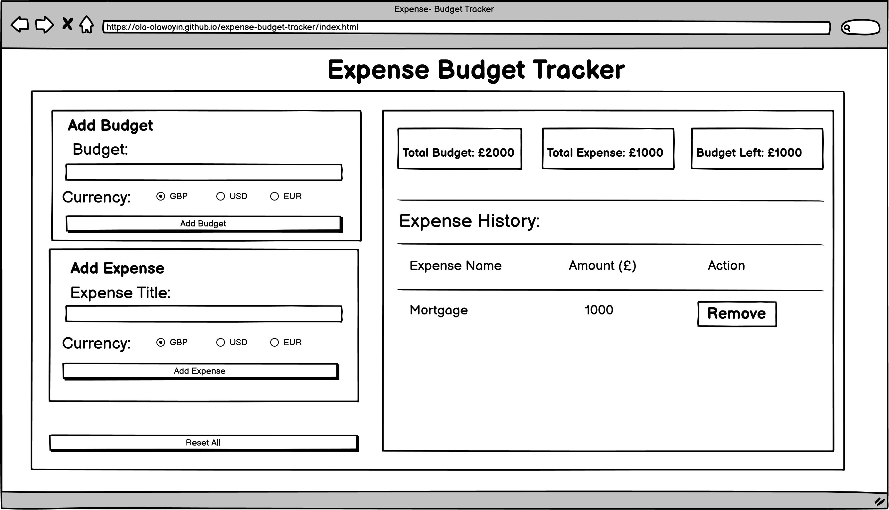
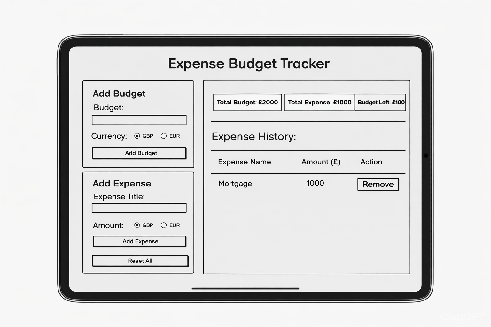
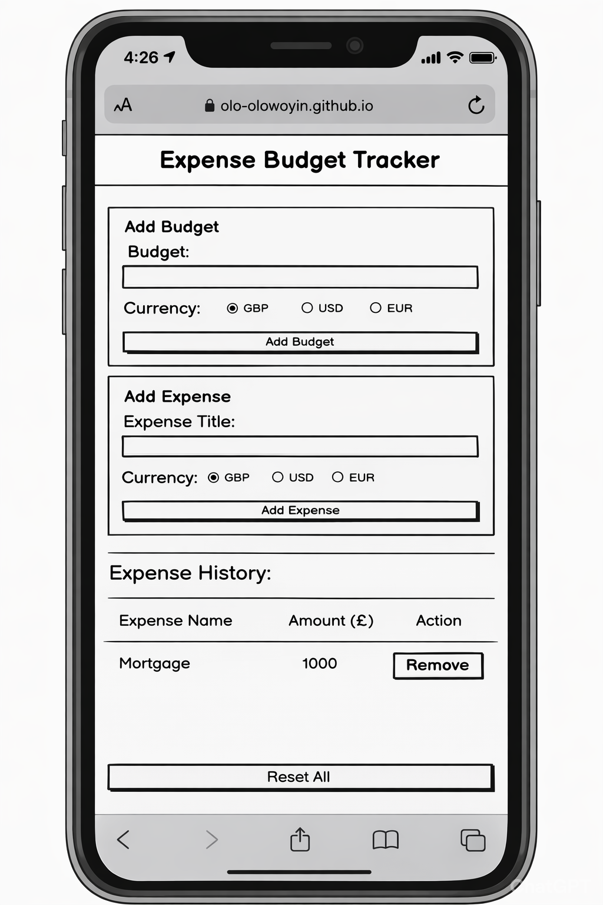

# Budget Expense Tracker*
Budget Expense Tracker is a simple, responsive web application for managing personal finances. It allows users to set a budget, log expenses, remove expense, track spending and view remaining balance at a glance. The app supports multiple currencies and view remaining balance at a glance. The app supports multiple currencies, provides an expense history with remove action, and focuses on clarity and ease of use through a clean, intuitive interface.

This site can be accessed by this [link](https://ola-olawoyin.github.io/budget-expense-tracker/)

## Project Goals:
The goal of this project is to build a simple and user-friendly expense tracking application that helps users understand and control their spending. It aims to demostrate core front-end development skills such as state management, user input handling, and UI design, while reinforcing best practices in manual testing, usability and maintainable code structure.

## Target Audience
This budget expense tracker is designed for individuals who want a simple, straightforward way to manage their personal finances. It's ideal for:

- **Students** tracking their monthly allowances and educational expenses
- **Young professionals** managing their first salary and building healthy spending habits
- **Freelancers** monitoring project-based income and business expenses
- **Budget-conscious individuals** looking to control spending and save money
- **International users** who need to track finances in GBP, USD, or EUR
- **Anyone seeking a lightweight, browser-based solution** without the complexity of full accounting software

The application is particularly suited for users who prefer immediate access without registration, value data privacy (with local storage), and need a clean, distraction-free interface for everyday expense tracking.

## User Story

### Currency Selection
As a user,
I want to select my preferred currency (GBP, USD, or EUR) for my budget tracker,
So that all my financial data is displayed in my chosen currency.

### Set Budget
As a user,
I want to set a budget amount in my selected currency,
So that I can establish a spending limit and track my finances effectively.

### Add Expense
As a user,
I want to add expenses with a title and amount in my selected currency,
So that I can record all my spending in one place.

### Budget Overview
As a user,
I want to see the total budget, total expenses, and remaining budget at a glance,
So that I can quickly understand my current financial position.

### Expense History
As a user,
I want to view a detailed history of all my expenses with their titles and amounts,
So that I can review my spending patterns and track where my money goes.

### Remove Expense
As a user,
I want to delete specific expenses from my history,
So that I can remove incorrect entries or expenses I no longer need to track.

### Reset All Data
As a user,
I want to reset all my budget and expense data,
So that I can start fresh with a clean slate when needed.

### Data Persistence
As a user,
I want my budget and expense data to be saved automatically,
So that I don't lose my information when I close and reopen the application.

---

## Future improvements
- Add edit button to the 'Expense History' section.
- Make budget incremental and not overriden
- Ability to add budget and expense with different currency concurrently

---

## Technologies Used
- [HTML](https://developer.mozilla.org/en-US/docs/Web/HTML) was used as the foundation of the site.
- [CSS](https://developer.mozilla.org/en-US/docs/Web/css) - was used to add the styles and layout of the site.
- [Bootstrap](https://getbootstrap.com/) - was used customised web designs and styling
- [Google Font](https://developers.google.com/fonts/docs/getting_started) - was used for customised fonts
- [Balsamiq](https://balsamiq.com/) was used to make wireframes for the website.
- [VSCode](https://code.visualstudio.com/) was used as the main tool to write and edit code.
- [Git](https://git-scm.com/) was used for the version control of the website.
- [GitHub](https://github.com/) was used to host the code of the website
- [HTML Validator](https://validator.w3.org/) to validate html files.
- [CSS Validator](https://jigsaw.w3.org/css-validator/) to validate css files.

---

## Design

### Color Scheme

- Light Blue Gradient was used as the main background color of the website to create a calm, clean, and friendly atmosphere. The soft gradient adds depth without overwhelming the user, promoting focus and ease of use.

- White and Off-White Shades were applied to cards, containers, and input fields to enhance readability and separation between sections. This helps structure the interface clearly and keeps the design minimal and professional.

- Medium to Deep Blue Tones were used for primary buttons, highlights, and key UI elements such as action buttons and summary cards. Blue conveys trust, reliability, and stability—important qualities for a financial tracking application.

- Red Accent Color was used sparingly for the “Reset All” button to signal caution and importance. Red naturally draws attention and communicates a destructive or irreversible action, helping prevent accidental clicks.

- Grey Text and Subtle Borders were used for headings, labels, and table dividers to maintain visual hierarchy while avoiding harsh contrasts, ensuring a smooth and modern user experience.

---

## Deployment

### Deployment to GitHub Pages

- The site was deployed to GitHub pages. The steps to deploy are as follows: 
  - In the [GitHub repository](https://github.com/Ola-Olawoyin/budget-expense-tracker), navigate to the Settings tab 
  - From the source section drop-down menu, select the **Master** Branch, then click "Save".
  - The page will be automatically refreshed with a detailed ribbon display to indicate the successful deployment.

The live link can be found [here](https://ola-olawoyin.github.io/budget-expense-tracker)

### Local Deployment

In order to make a local copy of this project, you can clone it.
In your IDE Terminal, type the following command to clone my repository:

- `git clone https://github.com/Ola-Olawoyin/budget-expense-tracker.git`

---

## Wireframe

#### Desktop devices
 

#### Tablet devices
 

#### Mobile devices
 

---

## Credits

+ #### Tools     
    - VSCode as source-code editor for HTML and CSS code
    - [Compress JPEG](https://compressjpeg.com/) was used to compress JPEG images.
    - [Balsamiq Wireframe](https://balsamiq.com) was used to design the project wireframes
    - [Screen to Gif](https://www.screentogif.com/) was used to convert video files to gif format
    - [coolors](https://coolors.co/) was used to create the color palette.
  

+ #### Content
    - Inspiration for project selection [100 Javascript projects](http://100jsprojects.com).
    - Understanding of project set up [Code Institute - Love Maths project](https://learn.codeinstitute.net/courses/course-v1:CodeInstitute+LM101+5/courseware/2d651[…]23e48aeb9b9218871912b2e/234519d86b76411aa181e76a55dabe70/).
    - Solution for injecting the 'Select currency' style retrospectively [ChatGPT](https://chatgpt.com/) 

## Acknowledgments

- [Rachel Furlong](https://github.com/RachelFurlong-dev) for mentoring and support.
- [Mark Lassoff](https://www.udemy.com/course/become-a-certified-web-developer) for HTML and CSS tutoring.
- [Code Institute](https://codeinstitute.net/) tutors and Slack community members for their support and help.
- [Lipika Magon](https://www.linkedin.com/in/lmagon) for spending time discussing project idea.
- [Sean Darley](https://www.linkedin.com/in/seandarley) for helping with testing the application.
- My wife [Adeola Olawoyin](https://www.linkedin.com/in/adeola-olawoyin-02550232) for providing support and encouragement and also the main tester of the application.
