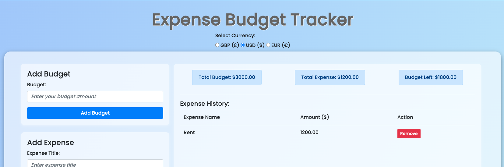
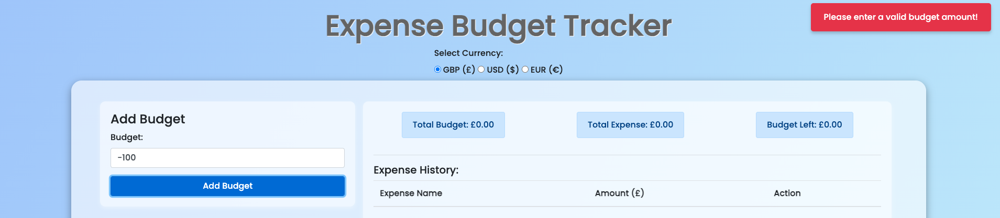
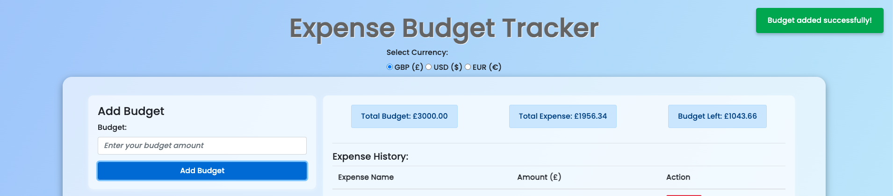

## TESTING

### What is Software Testing

Software testing is an aspect of software development that involves the systematic process of evaluating a software application to verify that it meets specified requirements and functions as intended. The goal of software testing is to identify defects, errors, or gaps early in the development lifecycle, ensuring the software is reliable, secure, and delivers a positive user experience. Effective software testing helps reduce risks, improve quality, and build confidence before releasing the product to end users.

Software Testing approach is generally divided into two (2) broad categories:

- Manual Testing
- Automation Testing

### Principles of Manual Testing

Manual testing involves a human tester executing test cases without using automation tools. The tester interacts with the application the same way an end user would.

#### Core Principles

- Human judgment & intuition – Testers observe behaviour, usability, and visual issues that tools often miss.
- Exploratory testing – Testers can deviate from scripts to discover unexpected defects.
- User-centric validation – Focuses on how real users experience the system.
- Flexibility – Tests can be quickly adapted as requirements change.
- Early defect discovery – Useful when features are still evolving.

#### When Manual Testing Is Best Deployed

- Early stages of development (new features, MVPs).
- Exploratory, ad-hoc, and usability testing.
- One-off or short-term projects where automation setup cost isn’t justified.
- UI/UX validation (look, feel, layout, accessibility).
- When requirements are unstable or unclear.

#### Limitations

- Time-consuming and repetitive.
- Prone to human error.
- Not scalable for large regression suites.

### Principles of Automation Testing

Automated testing uses scripts and tools to execute test cases automatically and compare actual results with expected outcomes.

#### Core Principles

- Repeatability – Tests can be run multiple times with consistent results.
- Efficiency & speed – Large test suites run faster than manual execution.
- Accuracy – Reduces human error in repetitive tests.
- Early feedback – Enables quick detection of regressions.
- Maintainability – Well-designed tests are reusable and easy to update.

#### When Automated Testing Is Best Deployed

- Regression testing.
- Smoke and sanity testing.
- Performance and load testing.
- Data-driven testing.
- Stable features with well-defined requirements.
- CI/CD pipelines where fast feedback is critical.

#### Limitations

- Initial setup time and cost.
- Requires technical skills.
- Less effective for subjective areas like usability or visual design.
- Maintenance overhead when the UI or requirements change frequently.

| Aspect         | Manual Testing         | Automation Testing                       |
| -------------- | ---------------------- | ---------------------------------------- |
| Execution      | Human-driven           | Tool/script-driventools                  |
| Speed          | Slower                 | Faster                                   |
| Accuracy       | Prone to human error   | Highly accurate once scripts are stable  |
| Cost           | Lower initial cost     | Higher initial setup cost                |
| Maintenance    | Easy to adapt          | Requires more technical ability          |
| Best Used For  | Exploratory, usability | Regression, performance                  |
| Human Judgment | Required               | Minimal once automated                   |
| Tools Required | No tools required      | Requires automation frameworks and tools |

### Testing Approach: Manual Testing

Manual testing has been chosen for the Budget Expense Tracker project due to its scope and nature. This is a one-off project with a limited feature set, and the initial time and effort required to design, implement, and maintain an automation framework would outweigh its benefits.

Manual testing allows for quicker validation of features, flexibility in exploring edge cases, and effective verification of user flows without additional tooling overhead. It is particularly suitable for validating usability, data accuracy, and overall behaviour during the early and final stages of development.

Given the project’s size, timeline, and objectives, manual testing provides a practical and efficient approach to ensuring quality while keeping development and testing costs realistic.

# Manual Test Cases – Budget Expense Tracker

## 1. Currency Selection

| Test Case ID | Test Scenario | Test Steps | Expected Result | Actual Result | Remarks |
|-------------|---------------|------------|----------------|---------------|---------|
| CUR-01 | Select GBP | Open app → Select GBP | All amounts display with £ | | |
| CUR-02 | Select USD | Change currency to USD | All amounts display with $ | | |
| CUR-03 | Select EUR | Change currency to EUR | All amounts display with € | | |
| CUR-04 | Change currency after setting budget | Set budget → Switch currency | Numeric value unchanged, symbol updates | | |
| CUR-05 | Currency persistence | Refresh page | Selected currency persists | | |

---

## 2. Set Budget

| Test Case ID | Test Scenario | Test Steps | Expected Result | Actual Result | Remarks |
|-------------|---------------|------------|----------------|---------------|---------|
| BUD-01 | Set valid budget | Enter valid amount | Budget saved and displayed | | |
| BUD-02 | Decimal budget | Enter 250.75 | Decimal accepted | | |
| BUD-03 | Zero budget | Enter 0 | Validation error shown | | |
| BUD-04 | Negative budget | Enter -100 | Budget not accepted | | |
| BUD-05 | Update budget | Modify existing budget | Budget updates correctly | | |

---

## 3. Add Expense

| Test Case ID | Test Scenario | Test Steps | Expected Result | Actual Result | Remarks |
|-------------|---------------|------------|----------------|---------------|---------|
| EXP-01 | Add valid expense | Enter title and amount | Expense added successfully | | |
| EXP-02 | Empty title | Leave title blank | Validation error shown | | |
| EXP-03 | Negative amount | Enter -50 | Expense not added | | |
| EXP-04 | Expense exceeds budget | Add high expense | Warning shown or negative balance | | |
| EXP-05 | Multiple expenses | Add several expenses | All displayed in history | | |

---

## 4. Budget Overview

| Test Case ID | Test Scenario | Test Steps | Expected Result | Actual Result | Remarks |
|-------------|---------------|------------|----------------|---------------|---------|
| OVR-01 | Budget only | Set budget | Expenses = 0, remaining = budget | | |
| OVR-02 | With expenses | Add expenses | Totals update correctly | | |
| OVR-03 | After deletion | Delete an expense | Totals recalculate | | |
| OVR-04 | Currency change | Switch currency | Currency symbols update | | |

---

## 5. Expense History

| Test Case ID | Test Scenario | Test Steps | Expected Result | Actual Result | Remarks |
|-------------|---------------|------------|----------------|---------------|---------|
| HIS-01 | View history | Add multiple expenses | All expenses listed | | |
| HIS-02 | Persistence | Refresh page | History persists | | |
| HIS-03 | Expense order | Add expenses | Correct order displayed | | |

---

## 6. Remove Expense

| Test Case ID | Test Scenario | Test Steps | Expected Result | Actual Result | Remarks |
|-------------|---------------|------------|----------------|---------------|---------|
| DEL-01 | Delete expense | Click delete | Expense removed | | |
| DEL-02 | Update overview | Delete expense | Totals update | | |
| DEL-03 | Delete last expense | Remove final item | Expense list empty | | |

---

## 7. Reset All Data

| Test Case ID | Test Scenario | Test Steps | Expected Result | Actual Result | Remarks |
|-------------|---------------|------------|----------------|---------------|---------|
| RES-01 | Reset data | Click Reset | Budget and expenses cleared | | |
| RES-02 | Persistence after reset | Refresh page | Data remains cleared | | |
| RES-03 | Reset confirmation | Click Reset | Confirmation shown (if implemented) | | |

---

## 8. Data Persistence

| Test Case ID | Test Scenario | Test Steps | Expected Result | Actual Result | Remarks |
|-------------|---------------|------------|----------------|---------------|---------|
| PER-01 | Auto-save | Add budget and expenses | Data saved automatically | | |
| PER-02 | Reopen app | Close and reopen app | Data restored | | |
| PER-03 | Currency persistence | Change currency → reload | Currency retained | | |

---

## 9. Responsiveness Testing

| Test Case ID | Device | Test Steps | Expected Result | Actual Result | Remarks |
|-------------|--------|------------|----------------|---------------|---------|
| RES-UI-01 | Desktop | Open app | Layout displays correctly | | |
| RES-UI-02 | Tablet | Resize to tablet width | No overlap or cutoff | | |
| RES-UI-03 | Mobile | Resize to mobile width | Readable stacked layout | | |
| RES-UI-04 | Mobile interaction | Tap buttons | Buttons are clickable | | |
| RES-UI-05 | Window resize | Resize browser | UI adjusts smoothly | | |
